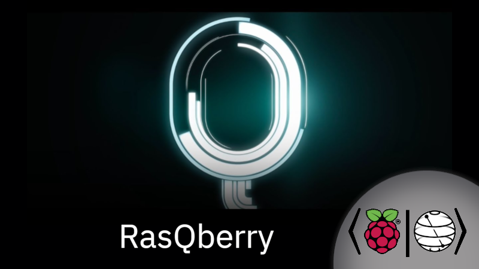
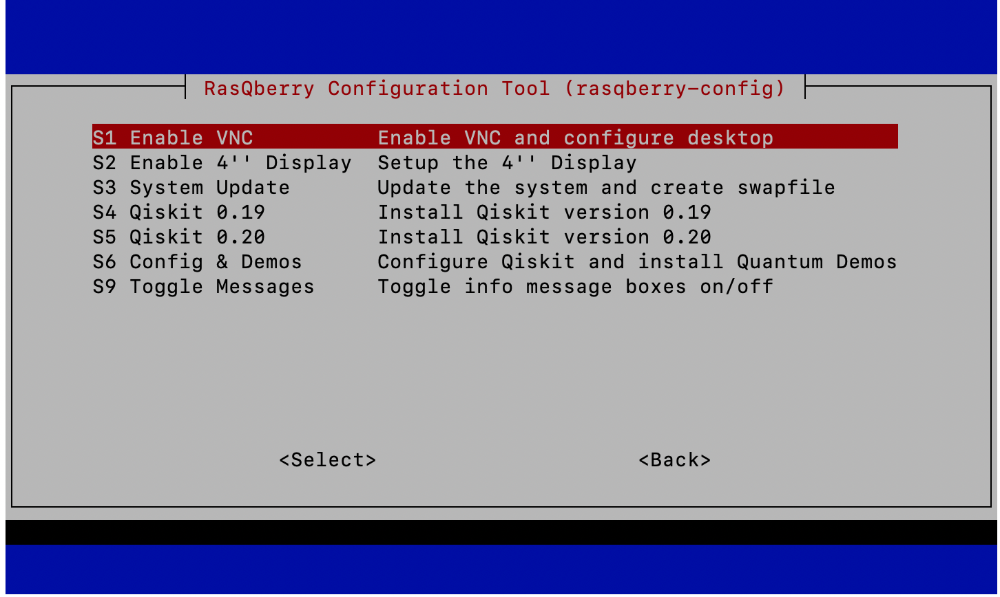
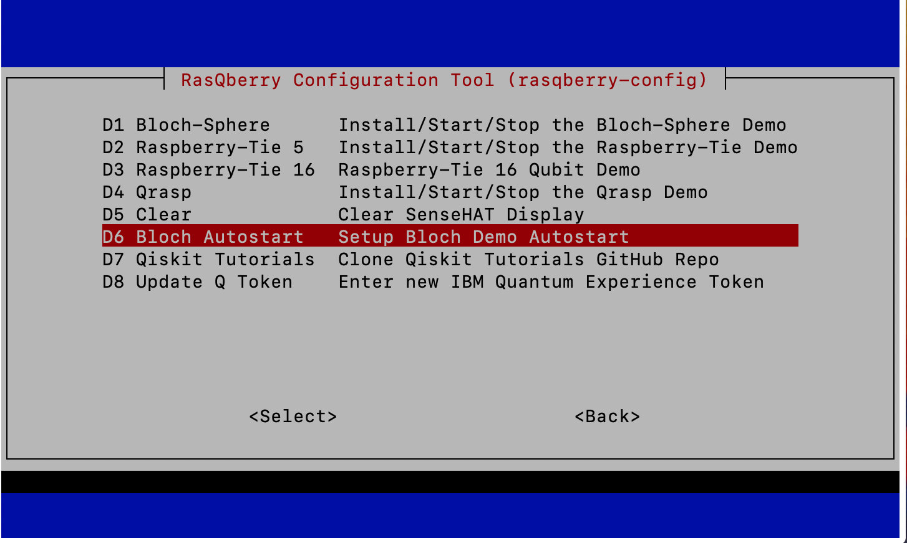

# RasQberry
### The RasQberry project: Exploring Quantum Computing and Qiskit with a Raspberry Pi and a 3D Printer

[Quantum Computing](https://en.wikipedia.org/wiki/Quantum_computing) - which is based on Quantum Mechanics - is a complex technology that is hard to understand for most people. Completely new algorithms - and even new thinking - is needed to exploit the potential power of upcoming quantum computers. This requires new approaches to teach Quantum Computing in engaging and understandable ways for IT experts, developers and young academics.

RasQberry integrates [Qiskit](https://qiskit.org/), a Raspberry Pi (the full range from Pi 4 down to a Pi Zero) and a 3D printed model of [IBM Q System One](https://www.research.ibm.com/quantum-computing/system-one/) to explore various state of the art technologies and create a tool that can be used in meetings, meetups, demo booths, etc. A spectrum of Quantum Computing demos and Serious Games for Quantum Computing (that illustrate superposition, interference and entanglement) will be made available on this device for an engaging introduction to Quantum Computing. 



### Qiskit on Raspberry Pi
A first discription how to install Qiskit on a Raspberry Pi is available at http://ibm.biz/Qiskit-Raspberry-Medium. It also includes a description how to setup some quantum demos (Qrasp, Raspberry-Tie) based on a Sense Hat 8x8 LED display.

A summary of that article has been published at hackster.io: https://www.hackster.io/news/jan-and-robert-lahmann-get-a-quantum-computer-running-on-your-raspberry-pi-in-under-30-minutes-4b972010009d

### RasQberry installation
The medium article http://ibm.biz/Qiskit-Raspberry-Medium includes a "fastpass" at the end, and mentions a procedure that only requires very few commands for the full setup. The following commands need to be executed in a terminal/ssh window on the Raspberry Pi with Raspberry OS "Buster". It will download and start a configuration tool "rasqberry-config", similar to the well known "raspi-config", that can be used to to some basic configuration, install Qiskit and several quantum demos. 
```python
pip3 install getgist
.local/bin/getgist -y JanLahmann RasQ-init.sh
. ./RasQ-init.sh
```

Also use the ". ./RasQ-init.sh" command to start the rasqberry-config tool again or "sudo rasqberry-config".

"rasqberry-config" offers a simple menu structure. To setup RasQberry, go through the menu items in "S RasQberry Setup" one by one. Some of them require a reboot. Select either Qiskit version 0.19 or version 0.20 to be installed. "S6 Config & Demos" installs and configures some of the quantum demos.
"D Quantum Demos" offers several Quantum demos, e.g. a Bloch Sphere demo (based on https://github.com/JavaFXpert/grok-bloch by James Weaver) that runs on a TFT display attached to the Raspberry, and two demos that run on a SenseHAT display: Raspberry-Tie (https://github.com/KPRoche/quantum-raspberry-tie by Kevin Roche) and Qrasp (https://github.com/ordmoj/qrasp by Hassi Norlen).


The above installation procedure used pre-compiled wheel files for most of the python packages. These are downloaded automatically from https://www.piwheels.org.
For the packages retworkx and qiskit-aer, currently there are no whl files available. Total install with local compile takes 25 minutes on RPi 4, on a Pi Zero about 4.5 hours.





### 3D model
An enclosure (3D model) of the IBM Q System One can be used for RasQberry. STL files are available at https://github.com/JanLahmann/RasQberry_enclosure (original source: https://github.com/BAndiT1983/RasQberry_enclosure). This is based on an idea of Andy Stanford-Clark (https://github.com/andysc/IBM-Q-System-One-3D-model). Additional instructions for assembling the enclosure and all components (Raspberry Pi, 4'' touchscreen display, battery pack inside the enclosure, etc) will be provided later.


[](http://www.youtube.com/watch?v=QkLW0Yw_pmg "RasQberry 3D model draft")

### Bil of Material
We will provide a more detailed BOM later. The following list should help to get you started:
1. 3D Model: see the above description and STL files. The 3D model is optional and not required for running Qiskit on the Raspberry Pi.
1. Raspberry Pi: we recommend a [model 4](https://www.raspberrypi.org/products/raspberry-pi-4-model-b/). For the currently existing demos, 2 GB RAM are sufficient. The Qiskit install procedure has also been tested sucesfully on a model Zero (precisely a model "Zero WH" for WLAN and GPIO connectivity), but a model 4 is much more responsive.
1. Micro SD card with at least 8GB. We recommend 16 GB.
1. Touch display. The following touch screen fits exactly into backplane of the current 3D model: [Miuzei Raspberry Pi 4 Touchscreen, 4 inch](http://www.miuzeipro.com/product/miuzei-raspberry-pi-4-touch-screen-with-case-fan-4-inch-ips-full-angle-game-display-800x480-pixel-support-hdmi-input-with-touch-pen-4-pcs-heatsinks-support-raspbian-kali-by-miuzei/). We plan to provide more flexibility in the future to support other types as well.
1. As an alternative to the touch screen, some of our demos can (only) be used with a [SenseHAT](https://www.raspberrypi.org/products/sense-hat/). The "closed backplane" of the 3D model can be modified to nicely fit the SenseHAT.
1. Some additional cables to connect the components, a power supply (optionally a battery pack that fits inside the 3D model), acrylic glass, LED ring, etc are needed for a complete model.

