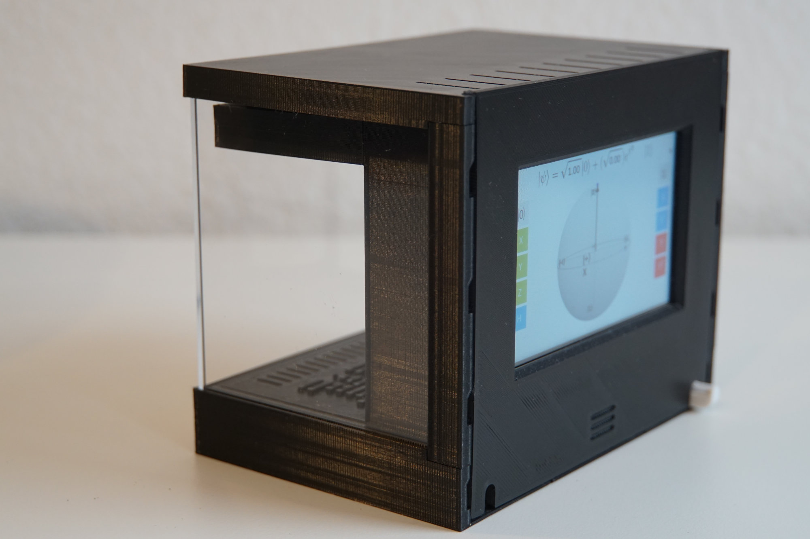
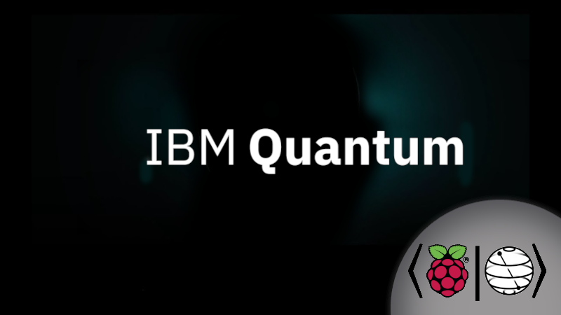
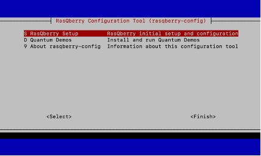
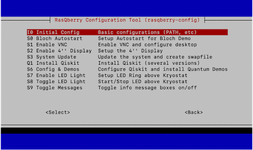

# RasQberry
## The RasQberry project: Exploring Quantum Computing and Qiskit with a Raspberry Pi and a 3D Printer

[Quantum Computing](https://en.wikipedia.org/wiki/Quantum_computing) - which is based on Quantum Mechanics - is a complex technology that is hard to understand for most people. Completely new algorithms - and even new thinking - is needed to exploit the potential power of upcoming quantum computers. This requires new approaches to teach Quantum Computing in engaging and understandable ways for IT experts, developers and young academics.

RasQberry integrates [Qiskit](https://qiskit.org/), a Raspberry Pi (the full range from Pi 4 down to a Pi Zero) and a 3D printed model of [IBM Q System One](https://www.research.ibm.com/quantum-computing/system-one/) to explore various state of the art technologies and create a tool that can be used in meetings, meetups, demo booths, etc. A spectrum of Quantum Computing demos and Serious Games for Quantum Computing (that illustrate superposition, interference and entanglement) will be made available on this device for an engaging introduction to Quantum Computing. 

 <br/>

## Qiskit on Raspberry Pi
A first discription how to install Qiskit on a Raspberry Pi is available at http://ibm.biz/Qiskit-Raspberry-Medium. It also includes a description how to setup some quantum demos (Qrasp, Raspberry-Tie) based on a Sense Hat 8x8 LED display.

A summary of that article has been published at hackster.io: https://www.hackster.io/news/jan-and-robert-lahmann-get-a-quantum-computer-running-on-your-raspberry-pi-in-under-30-minutes-4b972010009d

***

## Documentation

When you want your own RasQberry this repository is the right place!

* **If you want to build your very own RasQberry**<br/> 
Here you can find all the information to the [3D Model](./documentation/3DModel.md) you can see above itself and the [bill of material](./documentation/3DModel_BillOfMaterial.md) you will need, aswell as the [instructions](./documentation/RasQberry_Setup.md) for the setup and informations to the available [demos](./documentation/RasQberry_Demos.md).

* **If you get an RasQberry**<br/>
Here you can find all the information on [how to use your RasQberry](./documentation/HowToUse.md) and informations to the available [demos](./documentation/RasQberry_Demos.md).

***

## Quick Installation of RasQberry
When you already have a RasQberry that you can use you can install RasQberry in just a very few moments.<br/>
Open the terminal/ssh window on your Raspberry Pi.
```python
pip3 install getgist
.local/bin/getgist -y JanLahmann RasQ-init.sh
. ./RasQ-init.sh
```
<p align="center"> 
      
</p>

This will download and start the RasQberry Configuration Tool (rasqberry-config) in your terminal. It is similar to the well-known raspi-config and can also be used for some basic configurations. 
To start the tool again you can use 

```pyhton 
. ./RasQ-init.sh 
````

in your terminal/ssh window.

You can find the full instructions for the setup [here](./documentation/RasQberry_Setup.md).