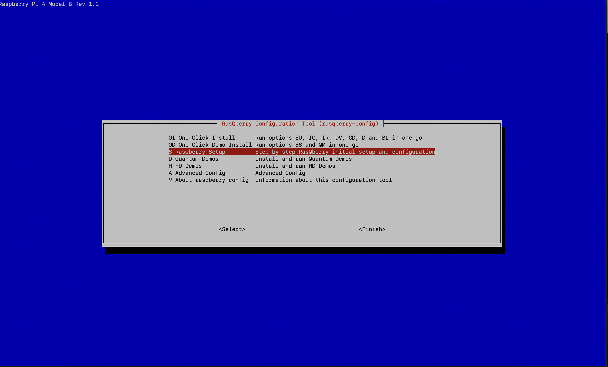

# RasQberry
## The RasQberry project: Exploring Quantum Computing and Qiskit with a Raspberry Pi and a 3D Printer

[Quantum Computing](https://en.wikipedia.org/wiki/Quantum_computing) - which is based on Quantum Mechanics - is a complex technology that is hard to understand for most people. Completely new algorithms - and even new thinking - is needed to exploit the potential power of upcoming quantum computers. This requires new approaches to teach Quantum Computing in engaging and understandable ways for IT experts, developers and young academics.

RasQberry integrates [Qiskit](https://qiskit.org/), a Raspberry Pi (the full range from Pi 4 down to a Pi Zero) and a 3D printed model of [IBM Q System One](https://www.research.ibm.com/quantum-computing/system-one/) to explore various state of the art technologies and create a tool that can be used in meetings, meetups, demo booths, etc. A spectrum of Quantum Computing demos and Serious Games for Quantum Computing (that illustrate superposition, interference and entanglement) will be made available on this device for an engaging introduction to Quantum Computing. 

## Qiskit on Raspberry Pi
A first discription how to install Qiskit on a Raspberry Pi is available at http://ibm.biz/Qiskit-Raspberry-Medium. It also includes a description how to setup some quantum demos (Qrasp, Raspberry-Tie) based on a Sense Hat 8x8 LED display.

A summary of that article has been published at hackster.io: https://www.hackster.io/news/jan-and-robert-lahmann-get-a-quantum-computer-running-on-your-raspberry-pi-in-under-30-minutes-4b972010009d

## RasQberry Installation and Setup

If you already have a raspberry pi with the latest version of Raspbian you can start at step 2.

### Step 1: Get your Raspberry Pi ready
Get the Raspberry Pi OS Raspbian at https://www.raspberrypi.org/software/operating-systems/#raspberry-pi-os-32-bit and write it with the Raspberry Pi Imager (https://www.raspberrypi.org/software/ ) on an (empty) SD-Card.
Do the default Setup of your Raspberry Pi by using raspi-config. 

### Step 2: Enable SSH (optional)
Open the terminal on your Raspberry Pi.	
sudo raspi-config.
Select “3 – Interface options”
Select “P2 – SSH”

Now you should be able to use SSH.

### Step 3: Installing RasQ
Open the terminal/ssh window on your Raspberry Pi.
pip3 install getgist
.local/bin/getgist -y JanLahmann RasQ-init.sh
. ./RasQ-init.sh

 
This will download and start the RasQberry Configuration Tool (rasqberry-config) in your terminal. It is similar to the well-known raspi-config and can also be used for some basic configurations. 
To start the tool again you can use RasQ-init.sh or sudo rasqberry-config in your terminal/ssh window.

### Step 4: RasQberry Setup
In the RasQberry Configuration Tool select “S – RasQberry Setup
1.	Select “I0 – Initial Config”
Your Raspberry will process the basic configurations on your device
2.	Select “S1 – Enable VNC” (required if you want to remotely access the screen)
With this step you will be able to use VNC
After this step is executed, you will have to reboot your device.
(See also: Install VNC Viewer)
3.	Select “S2 – Enable 4’’ Display” (required if using a touchscreen)
With this step you will be able to use a touchscreen with your Raspberry.
After this step is executed, you will have to reboot your device
4.	Select “S3 – Software Update”
With this step your device is searching for software updates and will execute them.
After this step is executed, you will have to reboot your device.
5.	Select “Q1 – Install Qiskit”
With this step you will install Qiskit. You can choose between a few versions of Qiskit to install. The latest version is recommended.
6.	Select “S0 – Bloch Autostart”
With this step your Raspberry will start the Bloch Sphere Demo automatically whenever you start your device. 
After your first time executing S0 your Raspberry will reboot automatically. After the reboot you should execute S0 again. This time there is no automatic reboot, but one is recommended.
7.	Select “S6 – Config & Demos” 
With this step you will configurate Qiskit automatically and install the Quantum Demos. Also, this step will configurate jupyter notebook.
8.	Select “S7 – Enable LED Lights” (optional)
With this step you can enable LED Lights that you connected to your Raspberry Pi.

The above installation procedure used pre-compiled wheel files for most of the python packages. These are downloaded automatically from https://www.piwheels.org. For the packages retworkx and qiskit-aer, currently there are no whl files available. Total install with local compile takes 25 minutes on RPi 4, on a Pi Zero about 4.5 hours.

### Demos
The Bloch Sphere Demo (based on https://github.com/JavaFXpert/grok-bloch by James Weaver) can be used with a simple Display.
The Demos Raspberry-Tie (https://github.com/KPRoche/quantum-raspberry-tie by Kevin Roche) and Qrasp (https://github.com/ordmoj/qrasp by Hassi Norlen) run on a SenseHat.

All of the Demos you can find and run in the RasQberry Configuration Tool under “D – Quantum Demos”.

### Cloning the Git-Repository with the Qiskit-demos 
If you want to clone the Git Repository to access the files, you need to open the RasQberry Configuration Tool. First select “D – Quantum Demos” and second “D7 – Qiskit Tutorials”.
This will take a moment to clone.
Here you will need to store your IBM Quantum Experience API Token, which you can get at https://quantum-computing.ibm.com/ .
When you entered your Token, you executed D7 successfully.
 
### Update your IBM Quantum Experience API Token
If you want to access IBM Quantum Experience you need an API Token.
If you want to update or store your API Token, you need to select “D – Quantum Demos” first and after that “D8 – Update Q Token”.
In the terminal you can now enter your new API Token.

### Disable the Bloch Autostart
You can disable the autostart of the BlochSphere Demo in the RasQberry Configuration Tool. First you need to select “D – Quantum Demos” and then “D9 – Disable Bloch Autostart”. The autostart is no disabled.

### Changing WLAN Settings
If you got handed an SD-Card where the above described installation already is made and you want to connect the Raspberry with your network you can do this in two possible ways.
1.	With the Raspberry Configuration Tool
Open your terminal/ssh window.
Sudo raspi-config
Select “1 System Options”.
When you select “S1 – Wireless LAN” you can enter your SSID and password.
2.	With the “wpa_supplicant.conf”-File
Open your termins/ssh window.
sudo nano /etc/wpa_supplicant/wpa_supplicant.conf
The file opens in your terminal/ssh window, and you can change the SSID and the password.
Save the changes and exit the file.

### Install VNC Viewer
To remotely access the screen of your Raspberry Pi you need to have a VNC Viewer installed on a different computer. 
To connect to your Raspberry Pi you need to open your VNC Viewer.
In the VNC Viewer you enter the VNC server-address from your Raspberry. After that you will need to enter a username (default: pi) and a password (default: raspberry).
Your VNC Viewer will now connect to your Raspberry Pi.

### Connect a LED Ring-Light to your Raspberry Pi
To connect your LED light, you need three cables (GND, VCC & IN).
Put your cables on the Raspberry Pins as follows:
•	GND-cable to Pin 6 [GND]
•	VCC-cable to Pin 4 [5V]
•	IN-cable to Pin 40 [GPIO21]

You can check which Pin on your Raspberry is the right one, when you type pinout in your terminal/ssh window.

Open your terminal/ssh window and type sudo python3 rq_LED-test.py -c
Your LED Light should now be turned on. To turn it of press ctl + c.

If this method doesn’t work, you can also open the RasQberry Configuration Tool. Select “S – RasQberry Setup”, then “S7 – Enable LED Light” and finally “S8 – Toggle LED Light”.
Your LED Light should now be turned on. To turn it off again select “S8 – Toggle LED Light” again.

## 3D model
An enclosure (3D model) of the IBM Q System One can be used for RasQberry. STL files are available at https://github.com/JanLahmann/RasQberry_enclosure (original source: https://github.com/BAndiT1983/RasQberry_enclosure). This is based on an idea of Andy Stanford-Clark (https://github.com/andysc/IBM-Q-System-One-3D-model). Additional instructions for assembling the enclosure and all components (Raspberry Pi, 4'' touchscreen display, battery pack inside the enclosure, etc) will be provided later.

## Bil of Material
We will provide a more detailed BOM later. The following list should help to get you started:
1. 3D Model: see the above description and STL files. The 3D model is optional and not required for running Qiskit on the Raspberry Pi.
1. Raspberry Pi: we recommend a [model 4](https://www.raspberrypi.org/products/raspberry-pi-4-model-b/). For the currently existing demos, 2 GB RAM are sufficient. The Qiskit install procedure has also been tested sucesfully on a model Zero (precisely a model "Zero WH" for WLAN and GPIO connectivity), but a model 4 is much more responsive.
1. Micro SD card with at least 8GB. We recommend 16 GB.
1. Touch display. The following touch screen fits exactly into backplane of the current 3D model: [Miuzei Raspberry Pi 4 Touchscreen, 4 inch](http://www.miuzeipro.com/product/miuzei-raspberry-pi-4-touch-screen-with-case-fan-4-inch-ips-full-angle-game-display-800x480-pixel-support-hdmi-input-with-touch-pen-4-pcs-heatsinks-support-raspbian-kali-by-miuzei/). We plan to provide more flexibility in the future to support other types as well.
1. As an alternative to the touch screen, some of our demos can (only) be used with a [SenseHAT](https://www.raspberrypi.org/products/sense-hat/). The "closed backplane" of the 3D model can be modified to nicely fit the SenseHAT.
1. Some additional cables to connect the components, a power supply (optionally a battery pack that fits inside the 3D model), acrylic glass, LED ring, etc are needed for a complete model.

