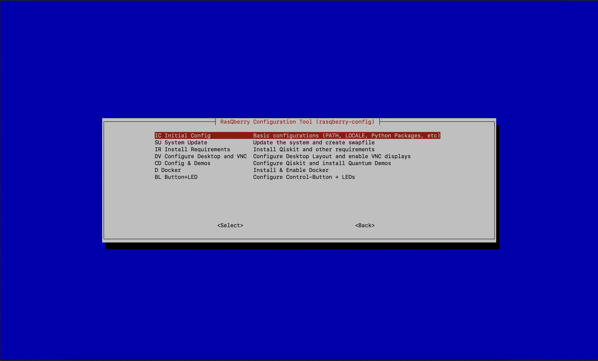

# RasQberry Installation and Setup

If you already have a raspberry pi with the latest version of Raspbian you can start at step 2.

## Step 1: Get your Raspberry Pi ready
With the Raspberry Pi Imager (https://www.raspberrypi.org/software/ ) write the Raspberry Pi OS Raspian on an (empty) SD-Card. You can either choose the Image right from the Raspberry Pi Imager or you can first download Raspian at https://www.raspberrypi.org/software/operating-systems/#raspberry-pi-os-32-bit.


Do the default Setup of your Raspberry Pi by using 
```python 
raspi-config
```
 For this you will need an Display or for an headless set up you’ll need to enable SSH.

<br/>

## Step 2: Enable SSH (optional)
You can enable SSH in different ways:  
* 	**With Display:**  
Open the terminal on your Raspberry Pi.	
```python
sudo raspi-config
```
&emsp;&emsp;&emsp;Select `3 – Interface options`  
&emsp;&emsp;&emsp;Select `P2 – SSH`

+ 	**Headless:**  
After you wrote the Raspian Image on your SD-Card you need to add a file named “*ssh*” in your boot partition.
When you added the file, you can now boot your Raspberry Pi.

Next, you’ll need to get the IP address from the Raspberry Pi. You can find the address in your Router’s DHCP lease allocation table or if you use a display, you can get your IP address by typing ifconfig in your terminal.

Open a terminal on your remote device and enter ssh pi@/[your IP address]
You need to agree that you want to connect your devices and enter your Raspberry Pi password (default: raspberry).
Now you should be able to use SSH.

<br/>

## Step 3: Installing RasQberry
Open the terminal/ssh window on your Raspberry Pi.
```python
pip3 install getgist
.local/bin/getgist -y JanLahmann RasQ-init.sh
. ./RasQ-init.sh
```

 

This will download and start the RasQberry Configuration Tool (rasqberry-config) in your terminal. It is similar to the well-known raspi-config and can also be used for some basic configurations. 
To start the tool again you can use 
```pyhton 
RasQ-init.sh 
````
in your terminal/ssh window.

<br/>

## Step 4: RasQberry Setup
### With touch display
In the RasQberry Configuration Tool select “S – RasQberry Setup
1.	Select `I0 – Initial Config`   
Your Raspberry will process the basic configurations on your device
2.	Select `S1 – Enable VNC` (required if you want to remotely access the screen)  
With this step you will be able to use VNC
After this step is executed, you will have to reboot your device.
(See also: Install VNC Viewer)
3.	Select `S2 – Enable 4’’ Display` (required if using a touchscreen)  
With this step you will be able to use a touchscreen with your Raspberry.
After this step is executed, you will have to reboot your device
4.	Select `S3 – Software Update`   
With this step your device is searching for software updates and will execute them.
After this step is executed, you will have to reboot your device.
5.	Select `Q1 – Install Qiskit`  
With this step you will install Qiskit. You can choose between a few versions of Qiskit to install. The latest version is recommended.
6.	Select `S0 – Bloch Autostart`   
With this step your Raspberry will start the Bloch Sphere Demo automatically whenever you start your device. 
After your first time executing `S0` your Raspberry will reboot automatically. After the reboot you should execute `S0` again. This time there is no automatic reboot, but one is recommended.
7.	Select `S6 – Config & Demos` (optional)  
With this step you will configurate Qiskit automatically and install the Quantum Demos. Also, this step will configurate jupyter notebook.  
This step will also configurate jupyter notebook and install the any required packages for the jupyter notebook, the Sense HAT and the Sense HAT Emulator.
8.	Select `S7 – Enable LED Lights` (optional)   
With this step you can enable LED Lights that you connected to your Raspberry Pi.

### With Sense HAT
In the RasQberry Configuration Tool select “S – RasQberry Setup
1.	Select `I0 – Initial Config`   
Your Raspberry will process the basic configurations on your device
2.	Select `S3 – Software Update`   
With this step your device is searching for software updates and will execute them.
After this step is executed, you will have to reboot your device.
3.	Select `Q1 – Install Qiskit`  
With this step you will install Qiskit. You can choose between a few versions of Qiskit to install. The latest version is recommended.
4.	Select `S6 – Config & Demos` (optional if using touchscreen; required if using Sense HAT)  
With this step you will configurate Qiskit automatically and install the Quantum Demos. Also, this step will configurate jupyter notebook.  
This step will also configurate jupyter notebook and install the any required packages for the jupyter notebook, the Sense HAT and the Sense HAT Emulator.

<br/>

The above installation procedure used pre-compiled wheel files for most of the python packages. These are downloaded automatically from https://www.piwheels.org. For the packages retworkx and qiskit-aer, currently there are no whl files available. Total install with local compile takes 25 minutes on RPi 4, on a Pi Zero about 4.5 hours.

<br/>

## Demos
The Bloch Sphere Demo (based on https://github.com/JavaFXpert/grok-bloch by James Weaver) can be used with a touch display.
The Demos Raspberry-Tie (https://github.com/KPRoche/quantum-raspberry-tie by Kevin Roche) and Qrasp (https://github.com/ordmoj/qrasp by Hassi Norlen) run on a SenseHat.

All of the Demos you can find and run in the RasQberry Configuration Tool under `D – Quantum Demos`.

<br/>

## Cloning the Git-Repository with the Qiskit-demos 
By executing the following instructions you clone a repository (https://github.com/Qiskit/qiskit-tutorials) with a collection of jupyter notebooks aimed at teaching people who want to use Qiskit for writing quantum computing programs, and executing them on one of several backends (online quantum processors, online simulators, and local simulators).

If you want to clone the Git Repository to access the with the Qiskit-Tutorials, you need to open the RasQberry Configuration Tool. First select `D – Quantum Demos` and second `D7 – Qiskit Tutorials`.  
This will take a moment to clone.  
Here you will need to store your IBM Quantum Experience API Token, which you can get at https://quantum-computing.ibm.com/ .  
When you entered your Token, you executed D7 successfully.
 
 <br/>

## Update your IBM Quantum Experience API Token
If you want to access IBM Quantum Experience you need an API Token.  
If you want to update or store your API Token, you need to select `D – Quantum Demos` first and after that `D8 – Update Q Token`.  
In the terminal you can now enter your new API Token.

<br/>

## Disable the Bloch Autostart
You can disable the autostart of the BlochSphere Demo in the RasQberry Configuration Tool. First you need to select `D – Quantum Demos` and then `D9 – Disable Bloch Autostart`.   
The autostart is no disabled.

<br/>

## Changing WLAN Settings
If you got handed an SD-Card where the above described installation already is made and you want to connect the Raspberry with your network you can do this in two possible ways.
1. With the Raspberry Configuration Tool
Open your terminal/ssh window.
```python
Sudo raspi-config
```
&emsp;&emsp;Select `1 System Options`.<br/>
&emsp;&emsp;When you select `S1 – Wireless LAN` you can enter your SSID and password.<br/>
<br/>
&emsp;&emsp;2.	With the `wpa_supplicant.conf`-File
Open your termins/ssh window.
```python
sudo nano /etc/wpa_supplicant/wpa_supplicant.conf
```
&emsp;&emsp;The file opens in your terminal/ssh window, and you can change the SSID and the password.<br/>
&emsp;&emsp;Save the changes and exit the file.<br/>
<br>
&emsp;&emsp;3.	With the display<br/>
&emsp;&emsp;First click on the WIFI-Icon in the top right corner of the screen and activate the WIFI.<br/>
&emsp;&emsp;Select your WIFI of choice. With the virtual keyboard you can enter the wpa-key.

<br/>

## Install VNC Viewer
To remotely access the screen of your Raspberry Pi you need to have a VNC Viewer installed on a different computer.   
To connect to your Raspberry Pi you need to open your VNC Viewer.  
In the VNC Viewer you enter the VNC server-address from your Raspberry. After that you will need to enter a username (default: pi) and a password (default: raspberry).  
Your VNC Viewer will now connect to your Raspberry Pi.

<br/>

## Connect a LED Ring-Light to your Raspberry Pi
To connect your LED light, you need three cables (GND, VCC & IN).
Put your cables on the Raspberry Pins as follows:
* GND-cable to Pin 6 [GND]
* VCC-cable to Pin 4 [5V]
* IN-cable to Pin 40 [GPIO21]

You can check which Pin on your Raspberry is the right one, when you type pinout in your terminal/ssh window.

Open your terminal/ssh window and type 
```python 
sudo python3 rq_LED-test.py -c
```
Your LED Light should now be turned on. To turn it of press ctl + c.

If this method doesn’t work, you can also open the RasQberry Configuration Tool. Select `S – RasQberry Setup`, then `S7 – Enable LED Light` and finally `S8 – Toggle LED Light`.  
Your LED Light should now be turned on. To turn it off again select `S8 – Toggle LED Light` again.

<br/>

## The Desktop Icons
When you installed RasQberry on your Raspberry Pi then there should be some icon on your desktop.

### BlochSphere Demo
 <br/>
If you click on this icon the Bloch Sphere Demo will open.

### IBM Quantum Composer
 <br/>
If you click on this icon the IBM Quantum Composer will open in your web browser

### Lights
 <br/>
If you click on this icon, you can toogle the lights, if you connected any to your raspberry Pi.

### Qiskit
 <br/>
If you click on this icon a terminal window opens in which you can see all the qiskit packages that are installed and their versions.

### RasQ-LED
 <br/>
If you click this icon the RasQ-LED Demo starts, if you connected any LED Lights to your Raspberry Pi.
