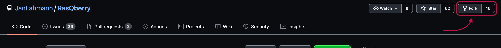
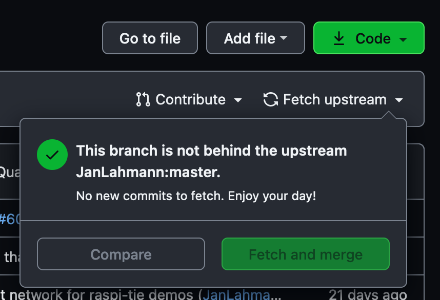
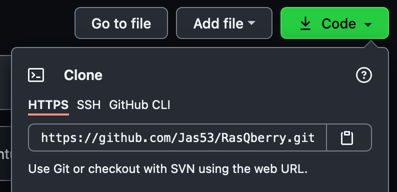
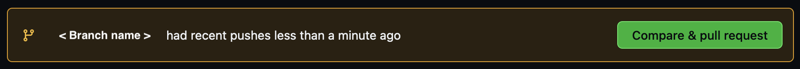
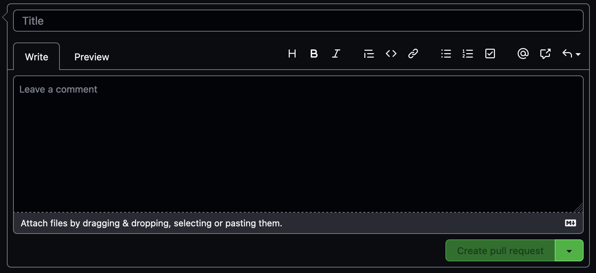

# How to Contribute
If you have an interesting idea you'd like to add or the solution to an issues you are welcome to contribute!<br/>
To contribute you will fork the repository. By forking the RasQberry-Repository you create a personal copy of the repo that will be stored under your account.<br/>
Later on you can submit your changes via Pull Request.<br/>
<br/>
You can use the following [checklist](./RasQberry_checkList.md) to run simple, manual regression tests and validate your modifications before creating a Pull Request.
Please update the checklist with additional tests related to your modifications, if applicable.

## 1. Fork the Repository
You can fork the RasQberry-Repo easily by clicking on the `fork`-button on the top right of the window.

<br/>
<p align="center">  
 <br/>
</p>
<br/>

Now you have a copy of the repo on your GitHub-Account.<br/>

To update your copied repository for changes you can click on `fetch upstream` and then compare the two Repositories. If any changes have been made you can select `Fetch and merge` and all changes will be updated in your repository.<br/>

<br/>
<p align="center">  
 <br/>
</p>
<br/>

If you made some changes at the same time it is possible that you will get a merge conflict. To work further on your changes you will need to resolve them.<br/>

## 2. Clone the copied repository
After you successfully forked the RasQberry-Repo you now need to clone on your local computer to work on it and to make some changes.<br/>
You can clone it either with the GitHub desktop tool or with the terminal

### with GitHub desktop
Open the GitHub desktop tool. You should be abel to see all the repositories connected to your GitHub account.<br/>
Select the forked RasQberry-Repo ({your username}/RasQberry), choose the path, where the repository will be saved and copied on your local computer and select `clone`.<br/>
Verify that the Repository is at the place you cloned it.<br/>
You can now make your changes.<br/>

### with the terminal
Open the terminal and change the current directory to the location you want to clone the repository.<br/>
To clone the repository you need to copy the HTTPS link to the online repository. You can find the link under `code` on the website. Click on the little clipboard to copy the link.<br/>
If you have added a public key you can clone the repository via SSH as well.

<br/>
<p align="center">  
 <br/>
</p>
<br/>

In the terminal you need to type 
```python
git clone
```
and paste the copied https link behind it.<br/>
Hit enter to clone the repository.<br/>

You can now make your changes.

## 3. Push your changes on the forked repository
If you made some changes on your local computer you need to push them first on your forked repository before you can create a pull request to push them onto the original repository.<br/>

### with GitHub desktop
Open the GitHub desktop tool and select the repository you are working on.<br/>
You can see all the changed, added or deleted files under the tab changes. All the files that are checked on the left side are staged.<br/>
Next you want to commit your staged files. It is required to add a little summary in which you comment what you did. After writing the summary you can commit the changes to your current branch.<br/>
After your commit you want to push the changes to the remote repository. For this you just click `Push origin` on the top of the window. It may take a moment and your changes are pushed to your remote repository.

### with the terminal
First you want to check which files are changed, added or deleted.
```python
git status
```
Now you can see all unstaged files in red and all already staged files in green. To commit and push your changes you need to stage all the files needed.<br/>
Type
```python
git add *
```
to stage all files or type instead of `*` the path for the specific file that you'd like to add.<br/>
With
```python
git status
```
you can check if all files that need to be staged are staged (green).<br/>

To commit your changed files you need to type
```python
git commit -m ""
```
In between the quotation marks you can add a comment on what you did.<br/>
After the commit you want to push them onto your remote repository.<br/>
Type
```python
git push origin HEAD
```
to push the changes on your current branch. If you already work on your master branch you can just type
```python
git push
```
as well.

## 4. Creating a Pull Request
If you are happy with your changes on your remote repository you are ready to propose the changes to the original repository.<br/>
Open your repository in your browser. You will see a banner that lets you compare your recent changes and creating a pull request. <br/>

<br/>
<p align="center">  
 <br/>
</p>
<br/>

Click on `Compare & pull request`. You will get redirected to a new page, where you need to enter a title and a description to your pull request. It is best practice to provide as much useful information on what you changed or added and why you changed or added it.<br/>
When you are done with your description you need to click on `Create pull request`.<br/>

<br/>
<p align="center">  
 <br/>
</p>
<br/>

Congratulations, you created a pull request!

[Go back to: Content](./README.md) <br/>
[Go back to: Start Page](../README.md) 
