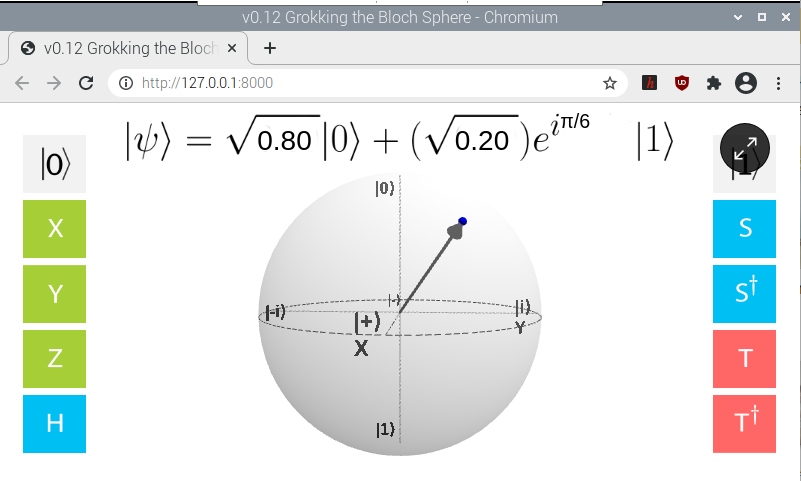
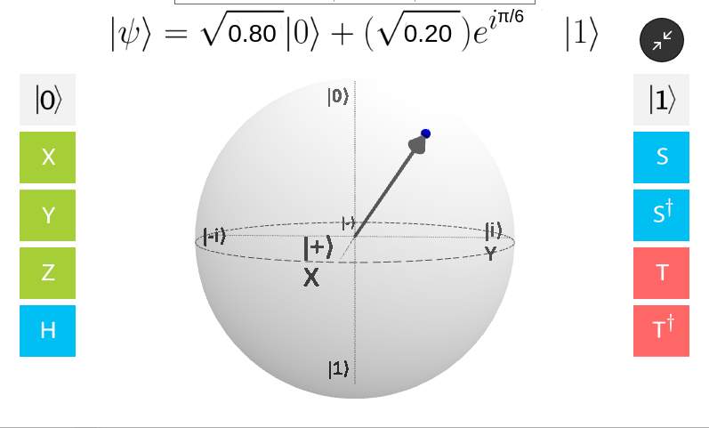
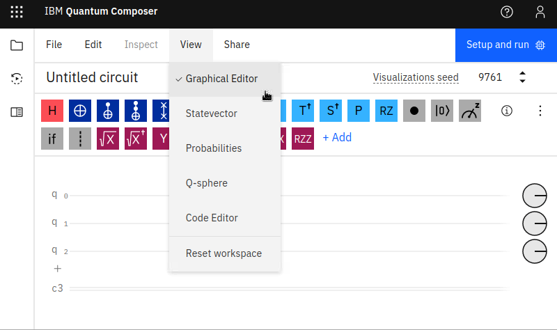

# How to use your RasQberry
In this document you can find informations on how to use your RasQberry

## Start your RasQberry
On the opposite site of your touch display you can see a hole, which is big enough to insert your stilo pen. By inserting th pen and pressing the button once you turn on the battery. 
On the right side from the touch display you can see a bigger hole. This is big enough for an USB-C Charger to recharge the battery if necessary.

 

  
  

 

## Overview Desktop
With your stylo pen you can tip onto the top of your touch display or if you have a mouse connected you can move it to top of your screen. 
The taskbar appears.

  
  

On the left side you can see the *applications menu*, the *RasQerry Configuration Tool*, the *reboot* button and the *shutdown* button. 
On the right side you can see the *VNC Viewer* and the *wifi*. 

 

## Bloch Sphere Demo
You need a display for this demo.
### Start
After your RasQberry Configuration the Bloch Sphere Demo should be autostarted whenever you boot your RasQberry.
You can also start it manually by clicking on the desktop icon *BlochSphereDemo*. 
You can enter fullscreen-mode by clicking on the icon on the right.

 

  
  

 

### Usage
You can click on the Bloch Sphere and use the bottons on the left and right side to change equation on the top. 
You can turn the bloch sphere itself and view it from different angle.

### Stop
You can exit fullscreen-mode by clicking the icon again.
Now you can exit the demo by closing the window.

 

## IBM Quantum Composer
You need a display for this demo.
### Start
You can start the IBm Quantum Composer by clicking on the desktop icon *IBM Quantum Composer*. 
The Quantum Compser will be started in fullscreen-mode.
 

  
  

 

### Usage
You can customize the view of the quantum composer to be clearly arranged by selecting the windows you want to use in the *View*-tab in the window.

### Stop
You can exit fullscreen-mode by tipping with your pen on or by moving your mouse to the very top of the screen and then clicking on the appearing *x*. 
Now you can exit the quantum composer by closing the window.

 

## Lights
You need to connect LED Lights to your Raspberry for this demo.
### Start and Stop

You can toggle your LEDs by clicking on the desktop icon *lights*.

## RasQ-LED
You need to connect LED Lights to your Raspberry for this demo.
### Start
To start the RasQ-LED Demo you need to click on the desktop icon *RasQ-LED*.

### Stop
You can stop the demo by interrupting the program with **ctl + c**.

 

## Raspberry Tie
You need a SenseHAT for this demo.
### Start
You can start both Rasqberry Tie demos (with either 5 or 16 qits simulated) in the Rasqberry Configuration Tool. 
In the tool, first select `D - Quantum Demos` and then either `D2 - Rasqberry-Tie 5` for the 5 qbit simulation or `D3 - Rasqberry-Tie 16` for the 16 qbit simulation.

### Stop
To stop the demo you need to select the same menu option (`D2`or `D3`) as before by starting this demo.

 

## Qrasp
You need a SenseHAT for this demo.
### Start
You can start the Qrasp demo in the Rasqberry Configuration Tool. 
In the tool, first select `D - Quantum Demos` and then `D4 - Qrasp` 

### Usage
You can controll the demo with the little joystick on th senseHAT. 
By pushing the joystick to the top you select the `GHZ`-option. 
By pushing the joystick to the bottom you select the `Bell`-option. 
By pushing the joystick to the right you select the `2Q`-option. 
By pushing the joystick to the left you select the `3Q`-option. 

### Stop
To stop the Qrasp demo by selecting `D4` again.

 

## Shutdown and turn of your RasQberry
First close all open windows. 
Next you need to shutsdown your Rasqberry pi. 
The last thing is to turn off the battery. In the hole on the oppisite site if the display, inster your stilo pen and press the button twice. The battery is now turned off.