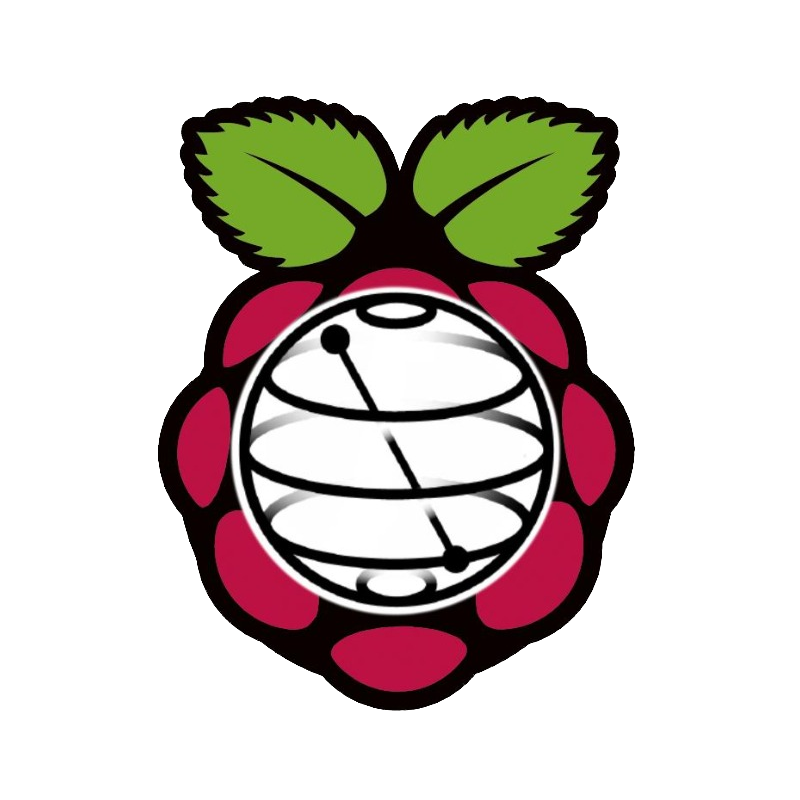

# How to use your RasQberry
In this document you can find informations on how to use your RasQberry

## Start your RasQberry
On the opposite site of your touch display you can see a hole, which is big enough to insert your stilo pen. By inserting th pen and pressing the button **once** you turn on the battery. 
On the right side from the touch display you can see a bigger hole. This is big enough for an USB-C Charger to recharge the battery if necessary.
 

  
  

 

 

  
  

 

## Shutdown and turn of your RasQberry
First close all open windows. 
Next you need to shutsdown your Rasqberry pi. 
The last thing is to turn off the battery. In the hole on the oppisite site if the display, inster your stilo pen and press the button **twice**. The battery is now turned off.

 

## Overview Desktop
With your stylo pen you can tip onto the very top of your touch display (first pixel-row) or if you have a mouse connected you can move it to top of your screen. 
The taskbar appears.
  

  
  

 

On the left side you can see the *applications menu,* the *RasQerry Configuration Tool*, the *reboot* button and the *shutdown* button. 
On the right side you can see the *VNC Viewer* and the *wifi*. 
You can find the virtual keyboard in the application menu under *Accessories*.
 
 

## The Desktop Icons
When you installed RasQberry on your Raspberry Pi then there should be some icon on your desktop.

### BlochSphere Demo
  
When you click on this icon the Bloch Sphere Demo will open.

### IBM Quantum Composer
  
When you click on this icon the IBM Quantum Composer will open in your web browser

### Lights
  
When you click on this icon, you can toogle the lights, if you connected any to your raspberry Pi.
By your first cklcik you start the LED Lights. By your second click you stop the LED Lights.

### Qiskit
  
When you click on this icon a terminal window opens in which you can see all the qiskit packages that are installed and their versions.

### RasQ-LED
  
When you click this icon the RasQ-LED Demo starts, if you connected any LED Lights to your Raspberry Pi.

### Clear LED Lights
  
When you click this icon you clear all attached LED Lights.

## The Applications Menu
In the Applications Menu you can find all RasQerry Demos. 
Under **Demos** you'll find the Demos that you can use with your touch display an the LED Lights. 
Under **HD Demos** you'll find the Demos we would recommend using a larger screen or the second VNC Screen. 

[Go back to: Content](./README.md)  
[Go back to: Start Page](../README.md) 
