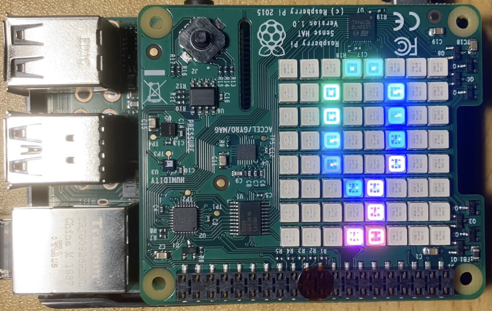
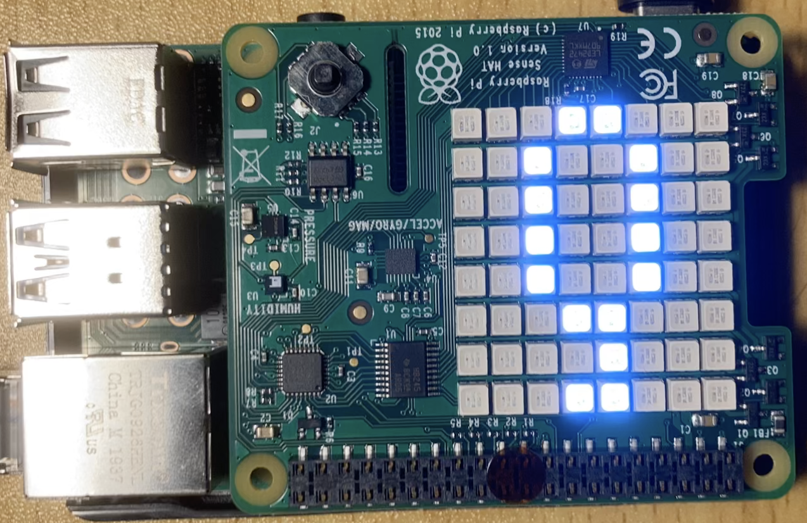
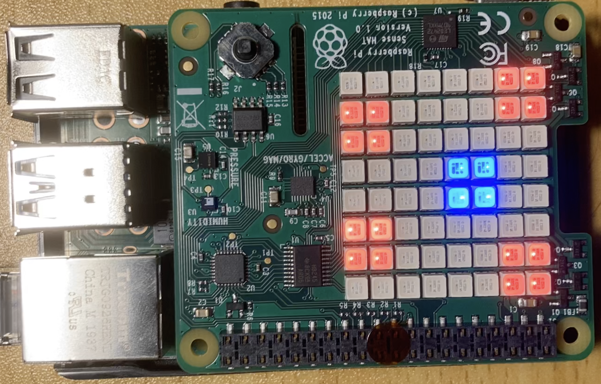
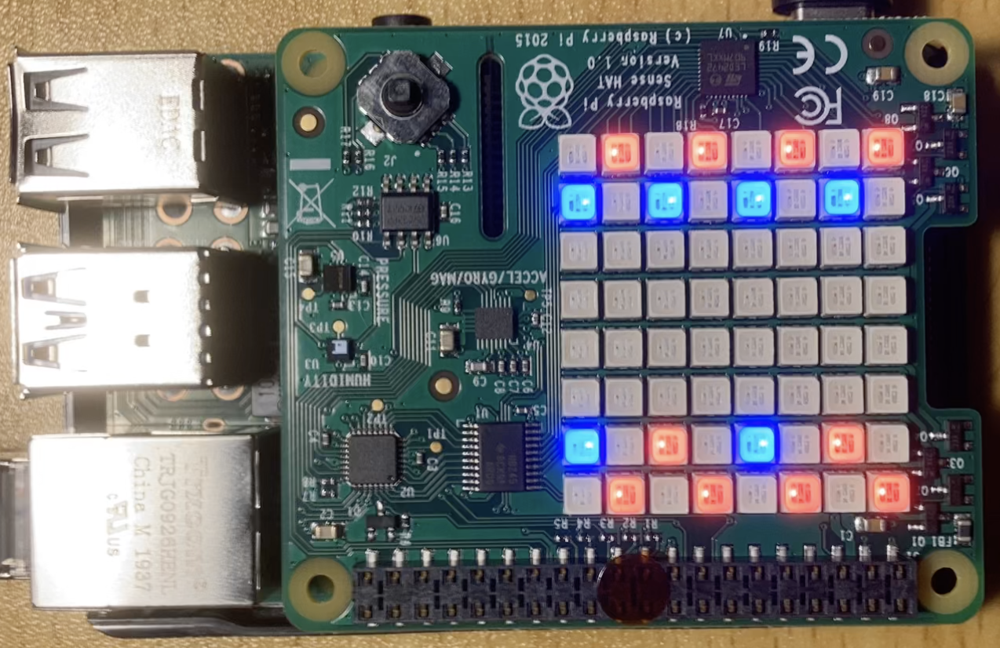

# RasQberry Demos
In this repository you can find diferent demos which also work with diferent hardware components. 

## Demos using a (touch) display
### Bloch Sphere  
In quantum mechanics and computing, the Bloch sphere is a geometrical representation of the pure state space of a two-level quantum mechanical system (qubit), named after the physicist Felix Bloch. 
In this demo you can investigate how the Bloch Sphere behaves under curtain changes. 

* **Start** 
After your RasQberry Configuration the Bloch Sphere Demo should be autostarted whenever you boot your RasQberry. 
If not installed, install, start and stop this demo by opening the Rasqberry Configuration Tool, selecting `D - Quantum Demos` and then `D1 - Bloch-Sphere`.  
You can also start it manually by clicking on the desktop icon *BlochSphereDemo*. 
Enter fullscreen-mode by clicking on the icon on the right. 

 
     

* **Usage** 
You can click on the Bloch Sphere and use the bottons on the left and right side to change equation on the top. 
You can turn the bloch sphere itself and view it from different angle.

* **Stop** 
You can exit fullscreen-mode by clicking the icon again.
Now you can exit the demo by closing the window.

The Bloch Sphere demo is based on https://github.com/JavaFXpert/grok-bloch by James Weaver. 
You can use this demo offline.

### Quantum Composer 
The IBM Quantum Composer allows public and premium access to cloud-based quantum computing services provided by IBM Quantum. This includes access to a set of IBM's prototype quantum processors, a set of tutorials on quantum computation, and access to an interactive textbook. 
You can use the quantum composer only while connected to a network.

* **Start** 
You can start the IBM Quantum Composer by clicking on the desktop icon *IBM Quantum Composer*. 
The Quantum Compser will be started in fullscreen-mode.

 
     

* **Usage** 
You can customize the view of the quantum composer to be clearly arranged by selecting the windows you want to use in the *View*-tab in the window.

* **Stop** 
You can exit fullscreen-mode by tipping with your pen on or by moving your mouse to the very top of the screen and then clicking on the appearing *x*. 
Now you can exit the quantum composer by closing the window.

### Lights 
You can connect LED Lightts to your Raspberry Pi. This demo starts a programm which lets the LED Lights shine in different colors and pattern.

 
       
       
       

* **Start and Stop** 
You can toggle your LEDs by clicking on the desktop icon *lights*.

### RasQ-LED 
When you have an LED Ring Light connected to your Raspberry Pi you can use RasQ-LED. 
This demo will randomly calculate which one of the single LEDs will be `0` and which will be `1`. Zeros will be red and ones will be blue.

* **Start** 
To start the RasQ-LED Demo you need to click on the desktop icon *RasQ-LED*.

  
       
       

* **Stop** 
You can stop the RasQ-LED demo by closing the window and than clicking on the *Turn LEDs off*-desktop icon. This will turn all LED lights, that are still turn on, off.s

## Demos using a SenseHAT

### Raspberry-Tie 
This demos comes in two alternatives. *Rasqberry-Tie 5* simulates 5 Qbits and *Rasqberry-Tie 16* simulates 16 Qbits. 
The Raspberry-Tie demos are based on https://github.com/KPRoche/quantum-raspberry-tie by Kevin Roche.  
* **Start** 
You can install both demo versions by opening the Rasqberr Configuration Tool, selecting `D - Quantum Demos` and then `D2 - Rasqberry-Tie 5`.  
To start the 16 Qbit version you need to execute `D3 - Rasqberry-Tie 16`. 

 
 
 

* **Stop** 
To stop the demo you need to select the same menu option (`D2`or `D3`) as before by starting this demo.

### Qrasp 
The Qrasp demo is based on https://github.com/ordmoj/qrasp by Hassi Norlen. 
* **Start**
If not installed, you can install, start and stop this demo by opening the Rasqberry Configuration Tool, selecting `D - Quantum Demos` and then `D4 - Qrasp`. 
 

 
 

 

* **Usage** 
You can controll the demo with the little joystick on th senseHAT. 
By pushing the joystick to the top you select the `GHZ`-option. 
By pushing the joystick to the bottom you select the `Bell`-option. 
By pushing the joystick to the right you select the `2Q`-option. 
By pushing the joystick to the left you select the `3Q`-option. 

* **Stop** 
To stop the Qrasp demo by selecting `D4` again.

## Continuative demos 
### Qiskit-Demos 
By cloning the git-repository with the qiskit-demos you have access to new jupyter notebooks that you can run and investigate. 

### Jupyter Notebooks 
In your Jupyter Notebook you can invastigate demos (e.g. the qiskit tutorials and demos) or can run your own code. 
By executing `S6 - Config & Demos` in the Rasqberry Configuration Tool you have acces to more demos that you can run in jupyter notebooks on your Raspberry Pi. You need to provide your API Token and the jupyter notebook will be configurated.
 

* **Start** 
To start the Jupyter Notebook you need to open the Rasqberry Configuration Tool. You can start it automatically with the Qiskit demos or with the Fun-qith-Quantum Demos.  
You need to select `H - HD Demos`and then the option you want. 
The Jupyter Noebook boots in the background ans you can access it over your browser or it will open on your RasQberry.  
 
If you want to start the jupyter notebook with the cloned Fun-with-Quantum or Qiskit-Tutorials Repository you can open the Rasqberry-Configuration Tool and select `H - HD Demos` and then choose the demo you want to access. 
 
When you are on your Raspberry you can access the Jupyter Notebook by opening http://raspberrypi:8888/ in your browser. When you want to access the Jupyter Notebook on your Laptop you can open it by typing http://{ip address}:{port}. The Default port is *8888*. You can find the corresponding portnumber in the messagebox.
The password is *RasQberry*. 
You can now use the Jupyter notebook.