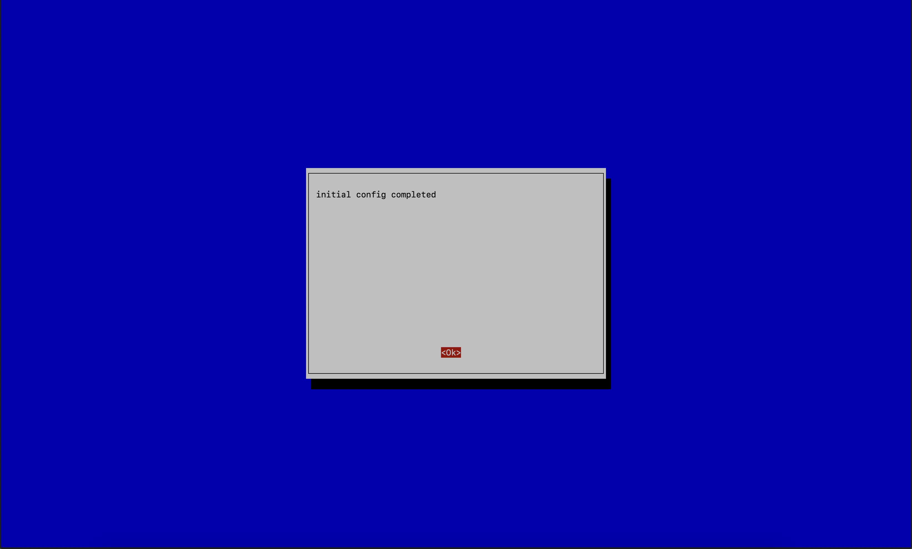
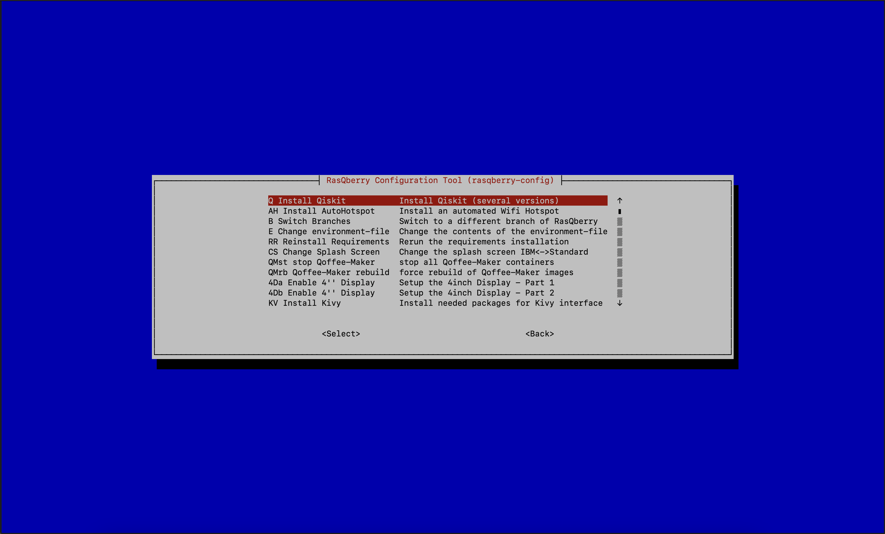
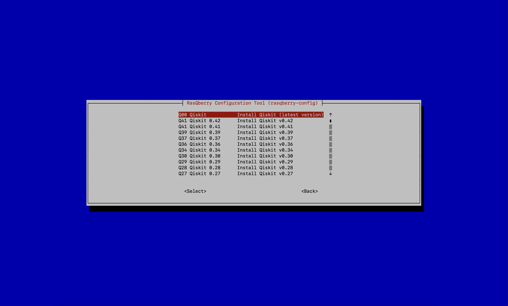

# RasQberry Installation and Setup

If you already have a Raspberry Pi with the latest version of Raspberry Pi OS you can start at step 2.

## Step 1: Get your Raspberry Pi ready
With the [Raspberry Pi Imager](https://www.raspberrypi.org/software/) write the Raspberry Pi OS Raspbian on an (empty) SD-Card. You can either choose the Image right from the Raspberry Pi Imager or you can first download [Raspberry Pi OS](https://www.raspberrypi.org/software/operating-systems/#raspberry-pi-os-32-bit).

<p align="center"> 
  <br/>
</p>

**(Optional)** Do the default Setup of your Raspberry Pi by using 
```python 
sudo raspi-config
```
 For this you will need a Display or for a headless setup you’ll need to enable SSH.

__<a style="color: red"> Very important__: You have to use the standard username `pi`. Otherwise, many functionalities will not work. </a>

<br/>

## Step 2: Enable SSH (optional)
You can enable SSH in different ways:  
+ 	**Headless (add file):**  
After you wrote the Raspbian Image on your SD-Card you need to add a file named “*ssh*” in your boot partition (boot register) of your SD-Card, which you can access on your personal computer.
When you added the file, you can now boot your Raspberry Pi.

* **Headless (with Imager):** <br/>
When you write the Raspberry Pi OS on your SD-Card you can enable SSH with the writing process. You can access the extended menu when entering **shift + command + X** (windows: **shift + control + X**)<br/>
<br/>
<p align="center">  
 <br/>
</p>
<br/>
You can enable SSH and enter your password or public-key to make the authenticating process while connecting easier.

* 	**With Display:**  
Open the terminal on your Raspberry Pi.	You can find the terminal in the application menu, under *Accessories*.
```python
sudo raspi-config
```
&emsp;&emsp;&emsp;Select `3 – Interface options`  
&emsp;&emsp;&emsp;Select `P2 – SSH`

Next, you’ll need to get the IP address from the Raspberry Pi. You can find the address in your Router’s DHCP lease allocation table or if you use a display, you can get your IP address by typing ifconfig in your terminal.

Open a terminal on your remote device and enter 
```python
ssh pi@/{your IP address}
```
You need to agree that you want to connect your devices and enter your Raspberry Pi password (default: raspberry).
Now you should be able to use SSH.

<br/>

## Step 3: Installing RasQberry
Open the terminal/ssh window on your Raspberry Pi.</br>
<a style="color:red"> Move to the home directory of the user pi (`/home/pi`). Not doing this will result in an error while installing and using the RasQberry. 
You go there by typing `cd` in the terminal. You can check your current working directory by typing in `pwd`.</a> </br>

The script can be run with parameters `. ./RasQ-init.sh devoption branch gituser`.

1. The `devoption` parameter is used to install the development version of the RasQberry repository (dev=1; production=0).
2. The `branch` parameter is used to specify the branch you want to use.
3. The `gituser` parameter is used to specify the GitHub user to clone the RasQberry repository from.

Example: `. ./RasQ-init.sh 1 master JanLahmann`

Default values are: `devoption=0` `branch=master` `gituser=JanLahmann`

```python
pip3 install getgist
.local/bin/getgist -y JanLahmann RasQ-init.sh
. ./RasQ-init.sh
```
<p align="center"> 
      
</p>

This will download and start the RasQberry Configuration Tool (rasqberry-config) in your terminal. It is similar to the well-known raspi-config and can also be used for some basic configurations. 
To start the tool again you can use 
```pyhton 
. ./RasQ-init.sh 
```
in your terminal/ssh window.

<br/>

## Step 4: RasQberry Setup
You can assemble your Hardware either with a (touch) display or with an senseHAT. It is not possible to use the senseHAT and the touch display on the same Raspberry Pi, because the senseHAT isn’t working with the installation process from the touch display.
<br/>

### With touch display
Open the RasQberry Configuration Tool and follow the steps below.
1. Select `S – RasQberry Setup`
   
<p align="center"> 
     
</p>

1. Select `SU – System Update`

<p align="center"> 
     
</p>

2. Select `IC - Initial Config`<br/>
Your Raspberry will process the basic configurations on your device.

<p align="center"> 
      
</p>

3. Select `A – Advanced Config` then `Q – Install Qiskit`<br/>
With this step you will install Qiskit. You can choose between a few versions of Qiskit to install. The latest version is recommended.

<p align="center"> 
       
</p>

4. Select `D – Quantum Demos` then run `BS – Bloch Sphere` and enable `BlockSphere Autostart` <br/>
With this step you Raspberry will start the Bloch Sphere Demo automatically whenever you start your device.<br/>

<p align="center"> 
       
</p>

After your first the executing `D` then `BS` your Raspberry will reboot automatically. After the reboot you should execute `D` then `BS` again. This time there is no automatic reboot, but one is recommended.

<p align="center"> 
       
</p>

5. Select `S - Rasberry Setup` then `CD – Config & Demos` (optional)<br/>
With this step you will configurate Qiskit automatically and install the Quantum Demos. Also, this step will configurate jupyter notebook.

<p align="center"> 
        
</p>

### With Sense HAT
Before the Raspberry Pi can boot with the SenseHAT attached you need to do some changes in the **config.txt**-file.<br/>
```python
/boot/config.txt
``` 
Open the **config.txt**-file and **un**comment the line 
```python
#hdmi_force_hotplug
```
Next, open the RasQberry Configuration Tool and follow the steps below.
1. Select `S – RasQberry Setup`
2. Select `G0 – System Update`
3. Select `G1 – Initial Config`<br/>
Your Raspberry will process the basic configurations on your device.
4. Select `G2 – Install Qiskit`<br/>
With this step you will install Qiskit. You can choose between a few versions of Qiskit to install. The latest version is recommended.
5. Select `S0 – Config SenseHAT`<br/>
With this step you will configurate the SenseHAT and the qrasp demo will autostart.

<br/>

The above installation procedure used pre-compiled wheel files for most of the python packages. These are downloaded automatically from [Piwheels](https://www.piwheels.org). For the packages retworkx and qiskit-aer, currently there are no whl files available. Total installation with local compile takes 10 minutes on RPi 4.

<br/>

## Update your IBM Quantum Experience API Token
If you want to access IBM Quantum Experience (to use e.g. the senseHAT demos) you need an API Token. 
If you want to update or store your API Token, you need to select `D – Quantum Demos` first and after that `D7 – Update Q Token`.  
In the terminal you can now enter your new API Token.

<br/>

## Cloning the Git-Repository with the Qiskit-tutorials 
By executing the following instructions you clone a [repository](https://github.com/Qiskit/qiskit-tutorials) with a collection of jupyter notebooks aimed at teaching people who want to use Qiskit for writing quantum computing programs, and executing them on one of several backends (online quantum processors, online simulators, and local simulators).

If you want to clone the Git Repository to access the with the Qiskit-Tutorials, you need to open the RasQberry Configuration Tool. First select `H - HD Demos` and second `Q1 - Qiskit Tutorials` (Jupyter Notebook starts automatically).<br/>
This will take a moment to clone and as the case may be to open the jupyter notebook.
 
 <br/>


## Disable the Bloch Autostart
You can disable the autostart of the BlochSphere Demo in the RasQberry Configuration Tool. First you need to select `D – Quantum Demos` and then `D8 – Disable Bloch Autostart`.   
The autostart is now disabled.

<br/>

## Changing WIFI Settings
If you got handed an SD-Card where the above described installation already is made and you want to connect the Raspberry with your network, you can do this in different ways.<br/>
* **Raspberry Pi Imager**<br/>
When you write the Raspberry Pi OS on your SD-Card you can set your WI-FI Settings with the writing process. You can access the extended menu when entering **shift + command + X** (windows: **shift + control + X**)<br/>
<br/>
<p align="center"> 
 <br/>
</p>

<br/>

In this panel you can enter your SSID and your wifi-password and select your Wi-Fi country.<br/>
When your boot your Raspberry Pi it should automatically connect to your Wi-Fi of choice. <br/>

<br/>

* **With the Raspberry Configuration Tool** <br/>
Open your terminal/ssh window.
```python
Sudo raspi-config
```
&emsp;&emsp;&emsp;Select `1 System Options`.<br/>
&emsp;&emsp;&emsp;When you select `S1 – Wireless LAN` you can enter your SSID and password.<br/>
<br/>

* **With the `wpa_supplicant.conf`-File before first boot** <br/>
Before you first boot your Raspberry Pi you can change the wpa_supplicant.conf-File on your SD-Card. In this File you can set your SSID and the password.<br/>
Save the changes and exit the file.<br/>
<br/>

* **With the `wpa_supplicant.conf`-File after first boot** <br/>
Open your terminal/ssh window.
```python
sudo nano /etc/wpa_supplicant/wpa_supplicant.conf
```
&emsp;&emsp;&emsp;The file opens in your terminal/ssh window, and you can change the SSID and the password.<br/>
&emsp;&emsp;&emsp;Save the changes and exit the file.<br/>
<br> 

* **With the display and a (virtual) keyboard**<br/>
First click on the WIFI-Icon in the top right corner of the screen and activate the WI-FI and select your WIFI of choice.<br/> 
If you don't have a keyboard with you, you can use a virtual keyboard that comes with the Raspberry Pi OS. You can find it in the menu under `Accessories`.<br/>
With the virtual keyboard you can enter the wpa-key.

<br/>

## Configuring Autohotspot
There is the option to configure a Hotspot which automatically activates when the configured WI-FI network (see wpa_supplicant.conf) is not available. This is done with the Autohotspot package. You can find more information about this package here: [Raspberry Pi - Auto Wi-Fi Hotspot Switch Internet](https://www.raspberryconnect.com/projects/65-raspberrypi-hotspot-accesspoints/157-raspberry-pi-auto-wifi-hotspot-switch-internet).

To activate and run the package, choose the options:

1. Select `S – RasQberry Setup`
2. Select `AH - Install AutoHotspot`
3. Choose number according to your use case (in most cases option `1` is recommended)
4. Exit with `8`

<br/>

## Install VNC and VNC Viewer
To remotely access the screen of your Raspberry Pi you need to have a VNC Viewer installed on a different computer. VNC has been tested using the [realVNC Viewer](https://www.realvnc.com/de/connect/download/viewer/). <br/>
Enable VNC by choosing the "DV Configure Desktop and VNC"-Option in the RasQberry Setup menu. </br>
To connect to your Raspberry Pi you need to open your VNC Viewer.  
In the VNC Viewer you enter the VNC server-address from your Raspberry. After that you will need to enter a username (default: pi) and a password (default: raspberry).  <br/>
Your VNC Viewer will now connect to your Raspberry Pi.

<br/>

## Connect a LED Ring-Light to your Raspberry Pi
To connect your LED light, you need three cables (GND, VCC & IN).
Put your cables on the Raspberry Pins as follows:
* GND-cable to Pin 6 [GND]
* VCC-cable to Pin 4 [5V]
* IN-cable to Pin 40 [GPIO21]

You can check which Pin on your Raspberry is the right one, with 
```python
pinout 
```
in your terminal/ssh window.

<p align="center"> 
  <br/>
</p>

Open your terminal/ssh window and type 
```python 
sudo python3 .local/bin/rq_LED-test.py -c
```
Your LED Light should now be turned on. To turn it off press ctl + c.

If this method doesn’t work, you can also open the RasQberry Configuration Tool. Select `S – RasQberry Setup`, then `S7 – Enable LED Light` and finally `S8 – Toggle LED Light`.  
Your LED Light should now be turned on. To turn it off again select `S8 – Toggle LED Light` again.

[Go back to: Content](./README.md) <br/>
[Go back to: Start Page](../README.md)  
