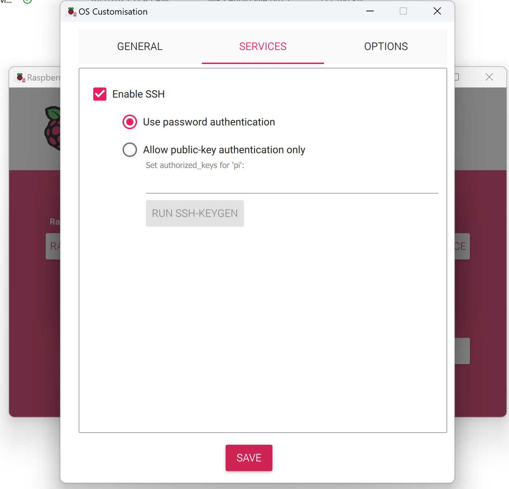
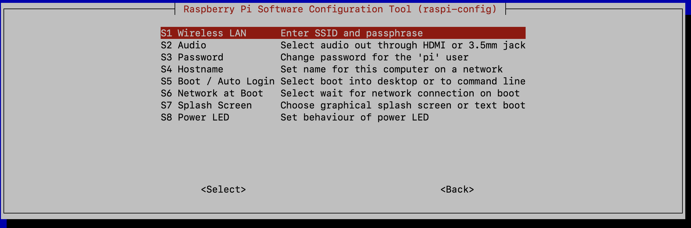

# RasQberry Test Report

The tests documented below were conducted under the following conditions:

Hardware used
- Raspberry Pi 4
- SanDisk Extreme Pro 64GB microSDXC UHS-I V30 card

Software used
- Raspberry Pi OS (Legacy 32 bit) with desktop
- Raspberry Pi Imager 1.8.5

```
pi@raspberrypi:~ $ lsb_release -a
No LSB modules are available.
Distributor ID:	Raspbian
Description:	Raspbian GNU/Linux 11 (bullseye)
Release:	11
Codename:	bullseye
pi@raspberrypi:~ $ uname -a
Linux raspberrypi 6.1.21-v8+ #1642 SMP PREEMPT Mon Apr  3 17:24:16 BST 2023 aarch64 GNU/Linux
```

Settings
- Default Username `pi` is used
- RasQberry is installed in the home directory of the default user `pi`

## Step 1: Preparing the Raspberry Pi 

1. Download and install Raspberry Pi Imager from the (official website)[https://www.raspberrypi.com/software/] and use that to write the Raspberry Pi OS (Legacy 32 bit) on an (empty) SD-Card. As seen in the images below, you can select the OS straight from the imager itself. 

<p align="center"> 
         <br/>
</p>

**(Option A: Settings Using Imager)** Using the Raspberry Pi Imager, we can choose to customize the wifi settings, username and password and enable ssh as shown below. 

__<a style="color: red"> NOTE__: You must use the standard username `pi`. Otherwise, many functionalities will not work. </a>

<br/>

<p align="center"> 
   <br/>
</p>

Once the OS and settings have been saved to the SD card, you can now boot your Raspberry Pi and connect it. 

There are several ways to find out which IP your Raspberry Pi received. For this particular test, a display was used to connect to the Raspberry Pi to enable the wireless interface and identify the IP address issued. 

**(Option B: Settings using Display)**  Ideally, with the aforementioned settings, your Pi should connect to WiFi once booted but if that is not the case, the following command can be used to perform initial setup of the Pi. To access terminal when using a display, navigate to the application menu, under *Accessories > Terminal.

```
sudo raspi-config
```

This command brings up menu options to choose from. 

1. Select `1 – System Options` 
2. Select `S1 – Wireless LAN` 
3. Fill in your WLAN network name under `Please enter SSID` 
4. Fill in your WLAN Password under `Please enter passphrase` 

<p align="center"> 
    <br/>
</p>

Apply the settings and select `Finish`. To view the IP address of your device, go back to the terminal and type `ifconfig` can be used. 

```
ifconfig 
```

## Step 2: Enable SSH (optional) 

There are a couple of ways you can use to enable SSH for remote administration. 

**Option A: Headless (with Imager)** 

As we saw in `option A of step 1` above, when you write the Raspberry Pi OS on your SD-Card you can enable SSH during the writing process. You can access the extended menu by entering **shift + command + X** (windows: **shift + control + X**)<br/>

<br/>
<p align="center"> 
 <br/>
</p>
<br/>

From this interface, you can enable SSH and enter your password or public-key to make the authenticating process while connecting easier.

**Option B: With Display** 

When using a display, to access the terminal on your Raspberry Pi,  navigate to the application menu, under *Accessories > Terminal*.

```
sudo raspi-config
```
1. Select `3 – Interface options`  
2. Select `I2 – SSH`
3. Click `Yes`

<br/>
<p align="center"> 
   <br/>
</p>
<br/>

**Option C: Headless (add file)** 

After writing the Raspberry Pi Image on your SD-Card you'll need to add a file named “*ssh*” in your boot partition (boot register) of your SD-Card, which you can access on your personal computer.
When you added the file, you can now boot your Raspberry Pi.

__<a style="color: red"> NOTE__: Added this option simply for completeness. This particular option was not tested for this report </a>

<br/>

Let's now get the IP address from the Raspberry Pi so that we can connect. You can find the address in your Router’s DHCP lease allocation table or if you use a display, you can get your IP address by typing ifconfig in your terminal.

```
ifconfig
```

With the IP address, we are now ready to connect remotely to the Raspberry Pi. Open a terminal on your remote device and `ssh` to the IP address using the username `pi` 

```
ssh pi@/{your IP address}
```

Example:

```
ssh pi@192.168.1.1
```

You are presented with a dialogue. You need to agree that you want to connect your devices and enter your Raspberry Pi password. By default, the password is `raspberry`. Now you should be able to use SSH moving forward.

<br/>

## Step 3: Installing RasQberry

**Prerequisites**

Before starting this section, the following needs to be true 

- [X] Installed Raspberry Pi OS Bullseye (Legacy 32 bit) with desktop
- [X] Made sure that you are using the default username `pi` 

Let's now navigate to the home directory of the user `pi`. __<a style="color: red"> NOTE__: Not doing this will result in an error while installing and using the RasQberry. </a>

<br/>

You can do that simply by typring `cd` then the user's path. 

```
cd /home/pi/
```

You can check which location you are currently in by running the `pwd` command. Output should be as shown below.

```
$ pwd 
/home/pi
```

Now we are finally ready to install RasQberry in just a few moments!

**Option A: Downloading the RasQberry OS (recommended way)**

The recommended way to get the OS is using `wget` command. Open the terminal/ssh window on your Raspberry Pi and run the following command to install from the master branch. 

```
wget https://github.com/JanLahmann/RasQberry/raw/master/RasQ-init.sh
```

**Option B: Downloading the RasQberry OS (no longer recommended)**

For this particluar test, an older way of downloading the file was used. To download the file from GitHub, run the `getgist` (python command)[https://pypi.org/project/getgist/]. 

```
pip3 install getgist
```

That command installed the following version of getgist as of date of testing. 

```
$ pip3 list | grep -i getgist
getgist           0.2.2
```

You can download the installation script `RasQ-init.sh` from the source `JanLahmann` using the `getgist <username> <filename>` command 

```
.local/bin/getgist -y JanLahmann RasQ-init.sh
```

As you can see, the newer way is easier and thus should be your go to instead of getgist. 

**Installing the RasQberry OS**

The command above downloads the script into the user's `pi` home directory as seen below. 

```
pi@raspberrypi:~ $ pwd
/home/pi
pi@raspberrypi:~ $ ls -l | grep RasQ-init.sh 
-rw-r--r-- 1 pi pi 3483 Aug 18 14:42 RasQ-init.sh
```

To start the installation, we need to run the script. The script can be run with specific parameters `. ./RasQ-init.sh <devoption> <branch> <gituser>` where:

1. The `devoption` parameter specifies which development version of the RasQberry repository to install. Specify `devoption=1` for development branch or `devoption=0` to download from production. 
2. The `branch` parameter is used to specify the branch you want to use. Example `branch=master` will download from the master branch. 
3. The `gituser` parameter is used to specify the GitHub user to clone the RasQberry repository from. Example `gituser=JanLahmann` will download from `JanLahmann`'s repository. 
 
If you choose to run the script without parameters, then the following default parameters will be used `devoption=0`, `branch=master` and  `gituser=JanLahmann`. 

For the test, we'll be downloading from the master branch, we want the production version in `JanLahmann`'s repository. We can run it with options like this `. ./RasQ-init.sh 0 master JanLahmann` but since that matches the default parameters, let's simply run the script. 

```
. ./RasQ-init.sh
```

This command downloads and starts the RasQberry Configuration Tool (rasqberry-config) in your terminal. It is similar to the well-known raspi-config and can also be used for some basic configurations. 

Once the script finishes, the SSH connection is closed for the following reason. 

```
**********************************************************************
/boot/config.txt will be modified to ensure 32 bit kernel being used
rebooting after modification of /boot/config.txt
After reboot, please login and restart the script RasQ-init.sh
**********************************************************************
```

We can now SSH back into the host and restart the script to start setting up. 

## Step 4: RasQberry Setup with touch display

Let's SSH back into the Raspberry Pi restart the `RasQ-init.sh` script again. 

```
. ./RasQ-init.sh 
```

This starts the RasQberry Configuration Tool (rasqberry-config) in the terminal. The tool is similar to the well-known `raspi-config` and can also be used for some basic configurations. We are presented with the below menu. 

<br/>
<p align="center"> 
 <br/>
</p>
<br/>

## Step 4a: One-Click Install with touch display

From the RasQberry Configuration Tool (rasqberry-config):

1. Select `OI – One-Click Install`. This will run options SU, IC, IR, DV, CD, D and BL in one go. 

The script ran for around 15 or so minutes. Here is a sample of some of the output that is seen when the script runs showing versions that were installed. 

```
...
Successfully installed python-dotenv-0.21.0
...
Successfully installed rpi-ws281x-5.0.0
...
Successfully installed pip-24.2
...
Successfully installed arraylias-0.1.1 asteval-1.0.2 asttokens-2.4.1 beautifulsoup4-4.12.3 charset-normalizer-3.3.2 comm-0.2.2 contourpy-1.2.1 cycler-0.12.1 decorator-5.1.1 dill-0.3.8 docplex-2.28.240 exceptiongroup-1.2.2 executing-2.0.1 fastdtw-0.3.4 fonttools-4.53.1 frozendict-2.4.4 h5py-3.11.0 importlib-resources-6.4.3 inflection-0.5.1 ipython-8.18.1 ipywidgets-8.1.3 joblib-1.4.2 jupyterlab-widgets-3.0.11 kiwisolver-1.4.5 lmfit-1.3.2 lxml-5.3.0 matplotlib-3.9.2 matplotlib-inline-0.1.7 more-itertools-10.4.0 mpmath-1.3.0 multiset-3.1.0 multitasking-0.0.11 nasdaq-data-link-1.0.4 networkx-3.2.1 numpy-2.0.1 packaging-24.1 pandas-2.2.2 pbr-6.0.0 peewee-3.17.6 platformdirs-4.2.2 ply-3.11 prompt-toolkit-3.0.47 pure-eval-0.2.3 pydot-3.0.1 pylatexenc-2.10 pyparsing-3.1.2 pyspnego-0.11.1 python-dateutil-2.9.0.post0 pytz-2024.1 pyyaml-6.0.2 qiskit-0.44.0 qiskit-algorithms-0.3.0 qiskit-dynamics-0.5.1 qiskit-experiments-0.5.4 qiskit-finance-0.4.0 qiskit-ibm-experiment-0.4.7 qiskit-machine-learning-0.7.2 qiskit-nature-0.7.2 qiskit-optimization-0.6.1 qiskit-terra-0.25.0 requests-2.32.3 requests-ntlm-1.3.0 rustworkx-0.15.0 scikit-learn-1.4.2 scipy-1.13.1 seaborn-0.13.2 stack-data-0.6.3 stevedore-5.2.0 sympy-1.13.2 threadpoolctl-3.5.0 traitlets-5.14.3 typing-extensions-4.12.2 tzdata-2024.1 uncertainties-3.2.2 wcwidth-0.2.13 websocket-client-1.8.0 widgetsnbextension-4.0.11 yfinance-0.2.41 zipp-3.20.0
...
Successfully installed ibm-quantum-widgets-1.0.3
qiskit                  0.44.0
qiskit-algorithms       0.3.0
qiskit-dynamics         0.5.1
qiskit-experiments      0.5.4
qiskit-finance          0.4.0
qiskit-ibm-experiment   0.4.7
qiskit-machine-learning 0.7.2
qiskit-nature           0.7.2
qiskit-optimization     0.6.1
qiskit-terra            0.25.0
...
Successfully installed Kivy-Garden-0.1.5 Pillow-9.2.0 PySocks-1.7.1 attrs-24.2.0 backcall-0.2.0 celluloid-0.2.0 certifi-2024.7.4 ewmh-0.1.6 h11-0.14.0 ipython-8.5.0 kivy-2.1.0 matplotlib-3.6.0 numpy-1.23.3 outcome-1.3.0.post0 pickleshare-0.7.5 python-xlib-0.33 rpi_ws281x-4.3.4 selenium-4.4.3 sense_hat-2.4.0 sniffio-1.3.1 sortedcontainers-2.4.0 tqdm-4.66.5 trio-0.26.2 trio-websocket-0.11.1 webdriver-manager-3.8.3 wsproto-1.2.0
...
Successfully installed anyio-4.4.0 argon2-cffi-23.1.0 argon2-cffi-bindings-21.2.0 arrow-1.3.0 async-lru-2.0.4 babel-2.16.0 bleach-6.1.0 cffi-1.17.0 debugpy-1.8.5 defusedxml-0.7.1 fastjsonschema-2.20.0 fqdn-1.5.1 httpcore-1.0.5 httpx-0.27.0 importlib-metadata-8.2.0 ipykernel-6.29.5 isoduration-20.11.0 jinja2-3.1.4 json5-0.9.25 jsonpointer-3.0.0 jsonschema-4.23.0 jsonschema-specifications-2023.12.1 jupyter-1.0.0 jupyter-client-8.6.2 jupyter-console-6.6.3 jupyter-core-5.7.2 jupyter-events-0.10.0 jupyter-lsp-2.2.5 jupyter-server-2.14.2 jupyter-server-terminals-0.5.3 jupyterlab-4.2.4 jupyterlab-pygments-0.3.0 jupyterlab-server-2.27.3 markupsafe-2.1.5 mistune-3.0.2 nbclient-0.10.0 nbconvert-7.16.4 nbformat-5.10.4 nest-asyncio-1.6.0 notebook-7.2.1 notebook-shim-0.2.4 overrides-7.7.0 pandocfilters-1.5.1 prometheus-client-0.20.0 ptyprocess-0.7.0 pycparser-2.22 python-json-logger-2.0.7 pyzmq-26.1.0 qtconsole-5.5.2 qtpy-2.4.1 referencing-0.35.1 rfc3339-validator-0.1.4 rfc3986-validator-0.1.1 rpds-py-0.20.0 send2trash-1.8.3 terminado-0.18.1 tinycss2-1.3.0 tomli-2.0.1 tornado-6.4.1 types-python-dateutil-2.9.0.20240316 uri-template-1.3.0 webcolors-24.8.0
...
Successfully installed rise-5.7.1
...
Installed Kivy
```

Once the installation is complete, the following screen is presented. 

<br/>
<p align="center"> 
 <br/>
</p>
<br/>

2. Select `OK` to exit and reboot. 
3. If done, select `Finish` to exit the setup. 

<br/>
<p align="center"> 

 <br/>
</p>
<br/>

Installation is now complete so Let's now reboot the system. Using the display, the following tests were conducted and errors logged as shown below. 

- [X] Started Jupyter Lab - Works 
- [X] Started Jupyter Notebook - Works 
- [ ] Started Kivy Interface - Nothing ** not sure what to see here**
- [X] Started Qiskit - Terminal pops up showing installed versions 
- [ ] Started Demos - Qoffe Maker (local) - 
  - ERROR from JupyterLab - Could not determine jupyterlab build status without nodejs
  - ERROR from browser 127.0.0.1:8887/?token=super-secret-token - site cannot be reached. 
- [ ] Started Demos - Qoffee Maker (dockerhub) - 
  - ERROR from terminal bash: line 1: cd: /home/pi/Qoffee-Maker/: No such file or directory 
  - ERROR from browser 127.0.0.1:8887/?token=super-secret-token - site cannot be reached. 
- [ ] Started Demos -  Ambilights - Not sure what to expect but terminal popped up and exited. 
- [X] Started Demos - BlochSphere Demo - Works 
- [ ] Started Demos - Clear LED Lights - Not sure what to expect 
- [ ] Started Demos - Fractals - ERROR** - terminal popped up then exited - not sure what to expect BUT there seems to be an error printed out though too quickly for me to read it 
- [ ] Started Demos - Lights - terminal popped up then exited - not sure what to expect
- [ ] Started Demos - RasQ-LED -  ERROR** - terminal popped up then exited - not sure what to expect BUT there seems to be an error printed out though too quickly for me to read it 
- [X] Started HD Demos - Fun with Quantum Repo - Navigates to Jan's repo regarding Fun with Quantum 
- [X] Started HD Demos - IBM Quantum Composer - Works 
- [X] Started HD Demos - Jupyter Notebook Fun with Quantum - A repo in Jupyter notebook is presented
- [X] Started HD Demos - Jupyter Notebook Qiskit Tutorials - A repo in Jupyter notebook is presented


