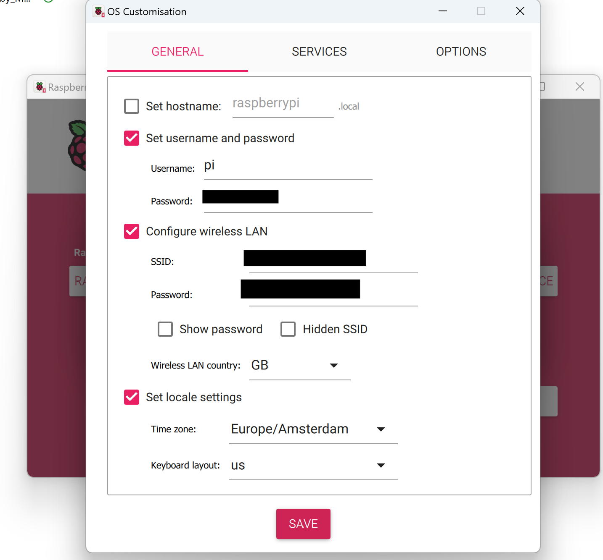

# RasQberry Test Report

The tests documented below were conducted under the following conditions:

Hardware used
- Raspberry Pi 4
- SanDisk Extreme Pro 64GB microSDXC UHS-I V30 card

Software used
- Raspberry Pi OS (Legacy 32 bit) with desktop
- Raspberry Pi Imager 1.8.5

Settings
- Username: pi 

## Step 1: Preparing the Raspberry Pi 

1. Download and Install Raspberry Pi Imager from the (official website)[https://www.raspberrypi.com/software/] and use that to write the Raspberry Pi OS (Legacy 32 bit) on an (empty) SD-Card. As seen in the images below, you can select the OS straight from the imager itself. 

<p align="center"> 
               <br/>
</p>

**(Option A: Settings Using Imager)** Using the Raspberry Pi Imager, you can choose to customize the wifi settings, username and password and enable ssh as shown below. 

__<a style="color: red"> NOTE__: You have to use the standard username `pi`. Otherwise, many functionalities will not work. </a>

<br/>

<p align="center"> 
      <br/>
</p>

Once the OS and settings have been saved to the SD card, you can now boot your Raspberry Pi and connect it. 

There are several ways to find out which IP your Raspberry Pi received. For this particular test, a display was used to connect to the Raspberry Pi to enable the wireless interface and identify the IP address issued. 

**(Option B: Settings using Display)**  Ideally, with the aforementioned settings, your Pi should connect to WiFi once booted but if that is not the case, the following command can be used to perform initial setup of the Pi. To access terminal when using a display, navigate to the application menu, under *Accessories > Terminal.

```python
sudo raspi-config
```

Select `1 – System Options` 


Select `S1 – Wireless LAN` 


Fill in your WLAN network name under `Please enter SSID` 


Fill in your WLAN Password under `Please enter passphrase` 


Apply the settings and select `Finish`. To view the IP address of your device, go back to the terminal and type `ifconfig` can be used. 

```python
sudo raspi-config
```

## Step 2: Enable SSH (optional) 


