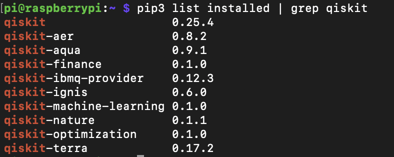
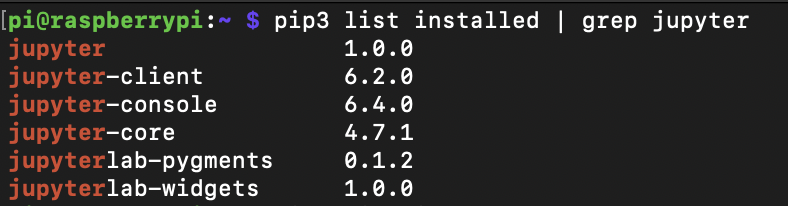
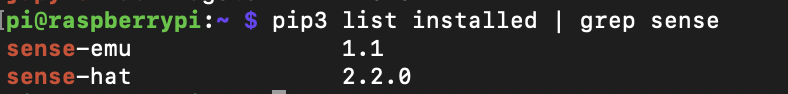

# Checklist
With this checklist you can test if everything works fine and is installed correctly.<br/>

- [ ] Desktop icons and background picture on display visible.<br/>
- [ ] The menu points in the RasQberry Configuration Tool can be executed without an error message.<br/>
- [ ] After executing menu point S1 the Rasqberry is accessible with the VNC Viewer.<br/>
    - [Instructions for checking if the VNC Viewer works](./RasQberry_Setup.md#install-vnc-viewer).<br/>
- [ ] After executing menu point S2 the touch display is usable.<br/>
- [ ] After executing menu point Q1 Qiskit is installed.<br/>
&emsp;&emsp;To check if Qiskit is installed open your terminal and type<br/> 
```python
pip3 list installed | grep qiskit
```
<br/>
<p align="center">  
 <br/>
</p>
<br/>

- [ ] After executing menu point S0 the Bloch Sphere Demo should start automatically after every reboot/log out.<br/>
- [ ] After executing menu point S7 the LED Lights can be used.<br/>

After executing menu point S6<br/>
- [ ] jupyter notebook and jupyter notebook widgets are installed and configured. <br/>
    - To check if jupyter notebook and the related packages are installed open your terminal and type
```python
pip3 list installed | grep jupyter
```
<br/>
<p align="center">  
 <br/>
</p>
<br/>

- [ ] the Fun-with-Quantum and Qiskit-tutorials Repositories are cloned and on the RasQberry available.<br/>
    - If cloned correctly you can find the Repositories in your file directory under `/home/pi/`<br/>
- [ ] jupyter notebook autostart is enabled on ports 8888 and 8889. <br/>
    - To test if the jupyter notebook starts correctly automatically after the reboot go in the browser on your PC and type in the URL window: {ip address RasQberry}:{portnumber} with the portnumbers 8888 and 8889.<br/>
- [ ] all needed packages for the SenseHAT demos are installed (Sense HAT und Sense HAT Emulator). <br/>
    - To check if all senseHAT related packages are installed open your terminal and type<br>

```python
pip3 list installed | grep sense
```
<br/>
<p align="center">  
 <br/>
</p>
<br/>
<br/>

The touch display demos are executable:<br/>
You can access these demos with the desktop-icons.<br/>
- [ ] Bloch Sphere Demo<br/>
- [ ] Quantum Composer<br/>
- [ ] Lights (Toggle)<br/>
- [ ] RasQ-LED <br/>
- [ ] Cryostat Ambilights (Toggle)<br/>
- [ ] Clear LED Lights<br/>
<br/>

The senseHAT Demos are executable:<br/>
You can access these demos with the RasQberry Configuration Tool under `D - Quantum Demos`.<br/>
- [ ] Rasqberry-Tie 5<br/>
- [ ] Rasqberry-Tie 16<br/>
- [ ] Qrasp<br/>

[Go back to: Content](./README.md) <br/>
[Go back to: Start Page](../README.md) 